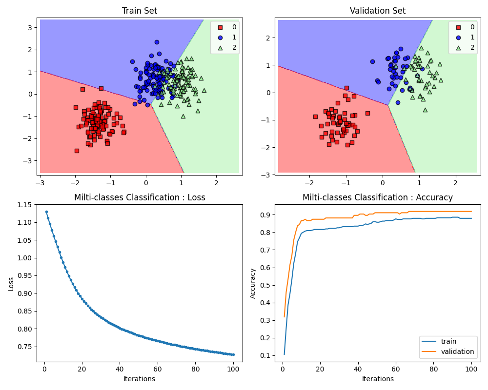

# data-classification-via-fixed-point-methods
Experimentation on various iterative fixed point methods for data classification

# Train demo command
```
python train.py --data 'source/sample_generated_data.csv' --loss MCE
```

# Experiment demo command
```
python experiment.py --test_data 'source/sample_generated_data.csv' --trained_model demomodel.pth --n_test .1
```

# Plan updated:
- Add opimizer i.e. ISFBA, PISFBA, IPFBA & related papers
- Add experiment codes
- Write some documents
