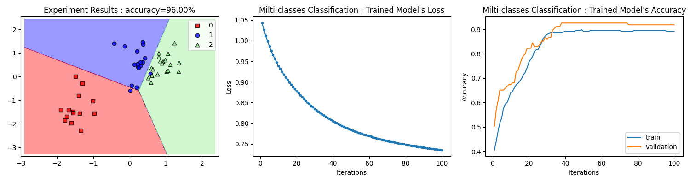
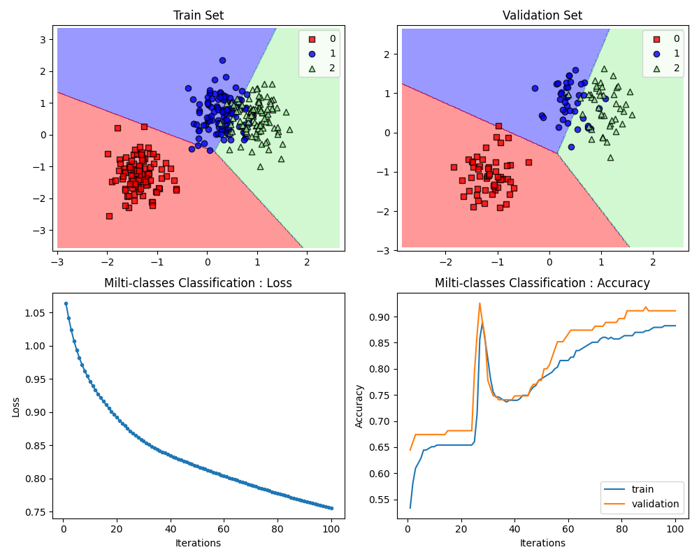
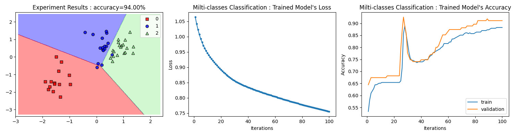

# data-classification-via-fixed-point-methods
Experimentation on various iterative fixed point methods for data classification

# What's New:
- forward-backward splitting optimizer (FBA) & inertial FBA optimizer (IFBA)
- SFBA, ISFBA, PFBA, IPFBA, ParallelSFBA, ParallelISFBA

# TODO:
- Write a document detail

# Train demo command
* Sample train SGD with default learning rate = 0.2
```
python train.py --data 'source/sample_generated_data.csv' --loss MCE
```
* Sample train ISFBA with L1-regularization & learning rate = 2.0 & control sequences defined as in ./cseq.json
```
python train.py --data 'source/sample_generated_data.csv' --loss MCE --optimizer ISFBA -p l1 -lr 2. -csd ./cseq.json
```
# Experiment demo command
```
python experiment.py --test_data 'source/sample_generated_data.csv' --trained_model demomodel.pth --n_test .1
```
# Experimantal results
- without Regularization:


- L1-Regularization:


- L2-Regularization:


