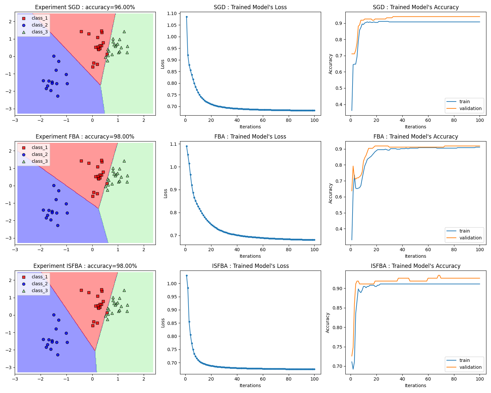

# Data Classification via Fixed Point Methods
Experimentation on various iterative fixed point methods for data classification

# What's New:
- forward-backward splitting optimizer (FBA) & inertial FBA optimizer (IFBA)
- SFBA, ISFBA, PFBA, IPFBA, ParallelSFBA, ParallelISFBA

# TODO:
- Write a document detail

# How to run code:
```bash
cd <repository_path>
conda activate <your_env_name>
python comparison.py
# have fun :)
```
# Supported:
> dataset

|Name|File name|n_classes|Source|
|----|-----------|---------|------|
|Sample generated data|sample_generated_data.csv|3|-|
|Iris|iris.data|3|[LINK](https://archive.ics.uci.edu/ml/datasets/Iris)|
|Abalone|abalone.data|3|[LINK](https://archive.ics.uci.edu/ml/datasets/Abalone)|
|Parkinsons|parkinsons.data|2|[LINK](https://archive.ics.uci.edu/ml/datasets/Parkinsons)|
|Heart Disease|heart.csv|2|[LINK](https://www.kaggle.com/datasets/johnsmith88/heart-disease-dataset?select=heart.csv)|
***
> optimizer

SGD, FBA, IFBA, SFBA, ISFBA, PFBA, IPFBA, ParallelSFBA, ParallelISFBA
***

# Train demo command
* Sample train SGD with default learning rate = 0.2
```python
python train.py --data source/sample_generated_data.csv --loss MCE
```
* Sample train ISFBA with L1-regularization & learning rate = 2.0 & control sequences defined as in ./cseq.json
```python
python train.py --data source/sample_generated_data.csv --loss MCE --optimizer ISFBA -p l1 -lr 2. -csd ./cseq.json
```
# Experiment demo command
```python
python experiment.py --test_data source/sample_generated_data.csv --trained_model demomodel.pth --n_test .1
```
# Experimantal results


# Reference
1. H. H. Bauschke and P. L. Combettes. Convex Analysis and Monotone Operator Theory in Hilbert Spaces. Springer Publishing Company, Incorporated, 2nd edition, 2017. [BOOK](https://link.springer.com/book/10.1007/978-1-4419-9467-7)
2. L. Bussaban, S. Suantai, and A. Kaewkhao. A parallel inertial s-iteration forward-backward algorithm for regression and classification problems. Carpathian Journal of Mathematics 36 (1), 35-44, 2020. [PAPER](https://www.carpathian.cunbm.utcluj.ro/article/a-parallel-inertial-s-iteration-forward-backward-algorithm-for-regression-and-classification-problems/)
3. L. Bussaban, S. Suantai, and A. Kaewkhao. Inertial s-iteration forward-backward algorithm for a family of nonexpansive operators with applications to image restoration problems. Filomat 35 (3), 771-782, 2021. [PAPER](http://www.doiserbia.nb.rs/img/doi/0354-5180/2021/0354-51802103771B.pdf)
4. A. Kaewkhao, L. Bussaban and S. Suantai. Convergence Theorem of Inertial P-iteration Method for a Family of Nonexpansive Mappings with Applications. Thai Journal of Mathematics 18 (4), 1743-1751, 2020. [PAPER](http://thaijmath.in.cmu.ac.th/index.php/thaijmath/article/viewFile/3856/354354774)